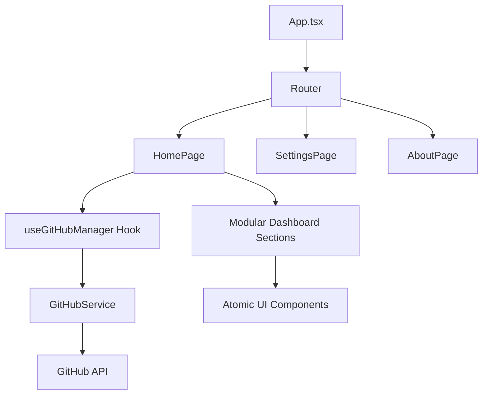

# 🚀 GitHub Follow Manager

[](https://reactjs.org/)
[](https://www.typescriptlang.org/)
[](https://vitejs.dev/)
[](LICENSE)

**GitHub Follow Manager** is a professional, high-performance tool designed to help developers manage their social relationships on GitHub. Analyze followers, identify non-mutual connections, and manage your network with a premium, animated dashboard.


## ✨ Features

- ⚡ **Lightning Fast**: Built with Vite 6 and React 18 for near-instant analysis.
- 💎 **Premium UI**: Dark-mode monochrome aesthetic with glassmorphism and smooth Framer Motion animations.
- 🛡️ **Privacy First**: Everything runs in your browser. Tokens are stored in `localStorage` and never touch a private server.
- 📊 **Deep Insights**: View detailed profiles, repository counts, and account age within the app.
- 📦 **Bulk Actions**: Unfollow non-followers or follow back fans in one click with intelligent rate-limit tracking.
- 🚦 **Rate Limit Monitoring**: Real-time status bar for GitHub API usage.

## 🚀 Quick Start

### Installation

```bash
# Clone the repository
git clone https://github.com/your-username/github-nonfollowers-cleaner.git

# Enter the project
cd github-nonfollowers-cleaner

# Install dependencies
npm install

# Start development server
npm run dev
```

### Usage

1. Generate a **GitHub Personal Access Token (Classic)**.
2. Ensure it has `read:user` and `user:follow` permissions.
3. Paste the token into the app along with your username.
4. Hit **Fetch & Analyze**.

## 🏗️ Architecture

The project follows a modular Atomic Design pattern:



## 🤝 Contributing

Contributions are what make the open source community such an amazing place to learn, inspire, and create. Any contributions you make are **greatly appreciated**.

See [CONTRIBUTING.md](CONTRIBUTING.md) for details.

## 📄 License

Distributed under the MIT License. See `LICENSE` for more information.

---

Built with ❤️ by [Arsh Verma](https://github.com/arshverma)
